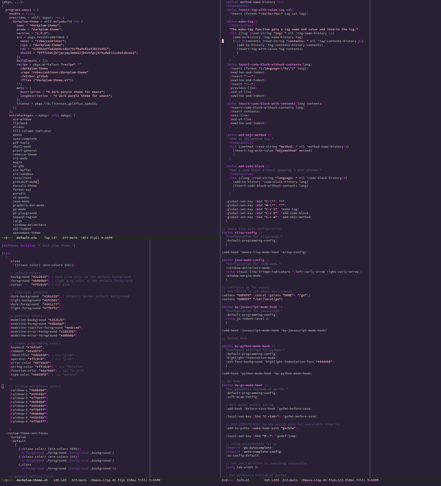

# DarkPlum Theme

DarkPlum is a dark purple theme, originally based on the [Rebecca
theme](https://github.com/vic/rebecca-theme).

## Screenshots



## Installation

### Nix With Home-Manager

If you manage your emacs configuration through [home
manager](https://github.com/nix-community/home-manager) then you can enable
darkplum with an overlay. For example:

```nix
  programs.emacs = {
    enable = true;
    overrides = self: super: rec {
      darkplum-theme = self.melpaBuild rec {
        name = "darkplum-theme";
        pname = "darkplum-theme";
        version = "1.0.0";
        src = pkgs.fetchFromGitHub {
          owner = "rebeccaskinner";
          repo = "darkplum-theme";
          rev = "524865effa82b64ccd5c791f9a9e851434531401";
          sha256 = "0fffzkwvjkijqrywy3m0m32jb4xhfgvj079ydwklc110z6zbxax2";
        };
        buildInputs = [];
        recipe = pkgs.writeText "recipe" ''
          (darkplum-theme
          :repo "rebeccaskinner/darkplum-theme"
          :fetcher github
          :files ("darkplum-theme.el"))
        '';
        meta = {
          description = "A dark purple theme for emacs";
          longDescription = "A dark purple theme for emacs";
        };
        license = pkgs.lib.licenses.gpl3Plus.spdxId;
      };
    };
    extraPackages = epkgs: with epkgs; [darkplum-theme];
  };
}
```

If you wish to update darkplum to the latest version, you can get the most
recent commit from github or from the repo by running `git log`. Update the `rev`
field of the overlay to the commit you wish to use. You can calculate the
`sha256` field using `nix-prefetch-url`, for example:

```
nix-prefetch-url --unpack "https://github.com/rebeccaskinner/darkplum-theme/archive/<rev>.tar.gz"
```

### Manual Installation

If you aren't using nix, you can install the theme manually. Clone this repo and
copy `darkplum-theme.el` to your emacs configuration directory (generally
`${HOME}/.emacs.d/`).

## Enabling The Darkplum Theme

If you are not using the emacs deamon you can enable the theme by adding the
line below to your configuration file (`${HOME}/.emacs.d/init.el`):

```
(load-theme 'darkplum t)
```

Restart emacs and the theme should be loaded.

### Enabling The Darkplum Theme With The Emacs Deamon

If you are using emacs clients with a single emacs deamon service, you might
find that the theme does not load correctly when loaded the simple way. You can
work around this by adding a frame hook to load the theme after creating a new
frame attached to the deamon. Add the following to your emacs configuration
file:

```elisp
(defun configure-look-and-feel ()
  "Run some stuff after init, like setting a theme and disabling scrollbars."
  ;; Setup theme
  (load-theme 'darkplum t)
  )

(defun deamon-look-and-feel (frame)
  "Wrapper to run look-and-feel per FRAME with emacsclient."
  (select-frame frame)
  (configure-look-and-feel)
  )

(if (daemonp)
    (add-hook 'after-make-frame-functions #'deamon-look-and-feel)
    (configure-look-and-feel)
  )
```

## Known Issues

This theme is still unfinished, and has does not yet support many editing
modes. It has also not been well tested in non-graphical environments.
